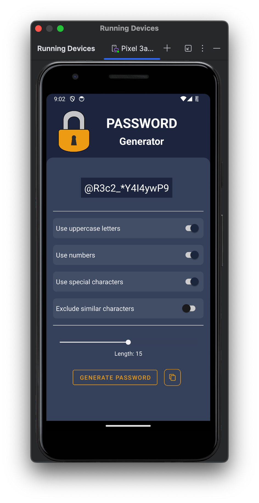

<h1 align="center">Password Generator 🔐</h1>

## Projeto 🎯 

Este projeto consiste em uma aplicação Android que implementa um gerador de senhas seguras e personalizáveis. A aplicação permite que o usuário crie senhas com diferentes critérios de segurança, garantindo a proteção de suas informações pessoais. Com uma interface simples e intuitiva, o usuário pode facilmente definir as características da senha desejada e copiá-la para a área de transferência com um clique.

## Layout 🎨 

  

## Tecnologias Utilizadas 🧑‍💻

- **Linguagem de Programação:**  Kotlin
- **Ambiente de Desenvolvimento:** Android Studio

##

Code by Dev. Júnio Moreira.
